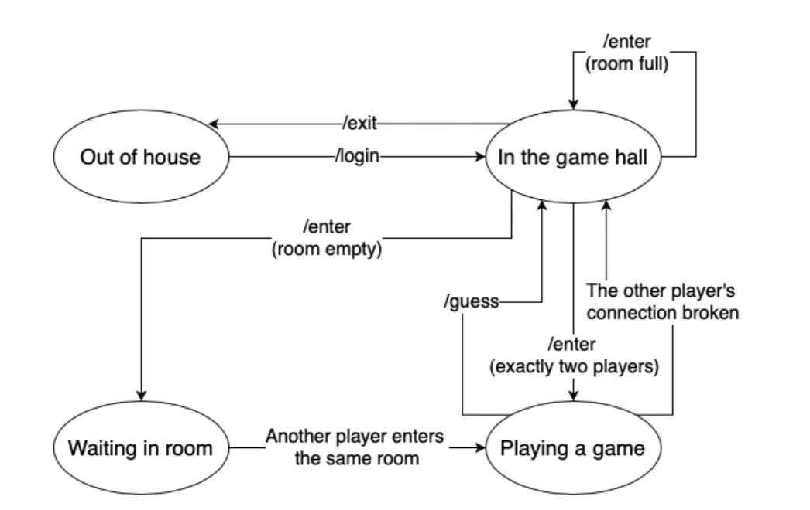

# Introduction of the game
* A game house is an application in which multiple clients connect to a game server, get authorized, and then select a game room to enter and play a game with another player in the same room.

* The game house application consists of two parts: the server program and the client program. 

* The server program should always be running and use a welcome socket to wait for connection requests from clients. 

* The client programs establish TCP connections with the server program. After a connection is set up, the client needs to send its user name and password to the server, and can enter the game hall after successful authentication. An authenticated user is able to query the status of the game rooms, and then pick a room to enter. To start a game, there should be exactly two players in the same room. Therefore, if the entering player is the first one in the room, the player has to wait; otherwise, the game starts. 

* After the game has started, the server generates a random boolean value and each player is invited to guess the boolean value; the player who guesses the same as the randomly generated value is the winner, and the game results in a tie if the two players’ guesses are the same. After notifying both players the game result, the game is over and both players return to the game hall. A user may leave the system when the user is in the game hall.

# Implementation notes

* In GameServer.py, there are one thread for each client.
The main implemenation is in 'onClientThread' function

* For state variable, there are 5 possible values:

1 stands for user authentication
In this while loop, it will continuously prompt user to input username and password until success.
'enter' is allowed, but will cause '4002'.
if not correct, will cause '1002'

2 stands for in the game hall
only allow /list, /enter command or it will send '4002'

22 stands for waiting for another player/in the waiting room
when the user is the first player who enters this room, create another thread called waitForPlayerThread.
This new thread is to check whether there is a new player in the room or not.
The parent thread is to get input from client.
The input could be the command for state 3, or an empty message(the msg client sends to server when it terminates interruptly)
An improvement in this part is that I assume there is no input from client, e.g. keyborad is dead.
Otherwise there will be no error warning but the input will be next command from client.

3 stands for playing a game
only allow /guess true, /guess false. othrewise will cause '4002'

33 stands for waiting for another guess
The client who first make a guess will generate a thread called waitForGuessThread.
This new thread is to check whether another player makes a guess or nor.
The parent thread is to get the input from client.
The input could be an empty message(the msg client sends to server when it terminates interruptly) or command for state 2
Also similar to state 22, no input in this waiting period.

except state 1, it's not allowed to just press 'enter', it will cause some error but haven't handled yet.